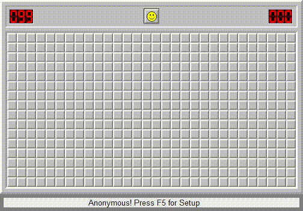
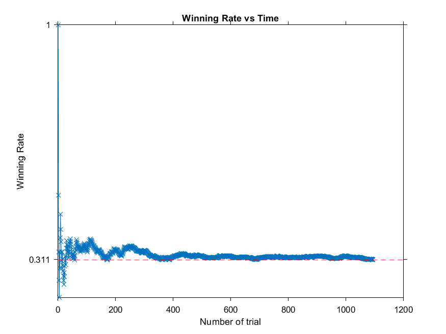

# myMineSweeperAI
Playing Minesweeper itself  

## Overview
- Minesweeper Version: Minesweeper Arbiter 0.52 distribution
- Time for each game: about 6s in Expert mode
- Win Rate: 31.1%  

- Algorithm: clicking the block that is least likely to be bomb.

## How to use it?
1. Install Python with proper environment.
2. Set hyperparameters in `hyperparams.py`.
3. Run `ms.py` in terminal `python ms.py`. You will see MineSweeper running itself.
4. Stop running by Middle-Click with your mouse
5. The outcome would be saved in log.txt. Each 0 denotes failure of 1 game and 1 denotes success of 1 game.

## Outline of the algorithm  
### 1. Get current minefield by reading the memory.   
### 2. We implement 2 different algorithms to solve the task.  
#### (1) Naive   
- For each block, if the number of bombs around it equals to the unexplored blocks around it, mark all unexplored blocks around it with flags.
- For each block, if the number of bombs around it equals to 0, click all unexplored blocks around it.
- If nothing is done above, click a random unexplored block. 
- Go back to the first step until the game is over.
#### (2) Normal  
- We regard each of the unexplored blocks as a variable. The value of these variables is 0 (safe) or 1 (bomb). And these variables satisfy many equations according to the blocks with number. Therefore, the task is to solve the multivariate linear equations.
- We solve it by `output_possibility = np.matmul(np.linalg.pinv(x), y)`. (not very accurate)
- Mark flags if `output_possibility` is 1 and click if `output_possibility` is 0. If nothing is done, then click the block with minimum `output_possibility`.
  
