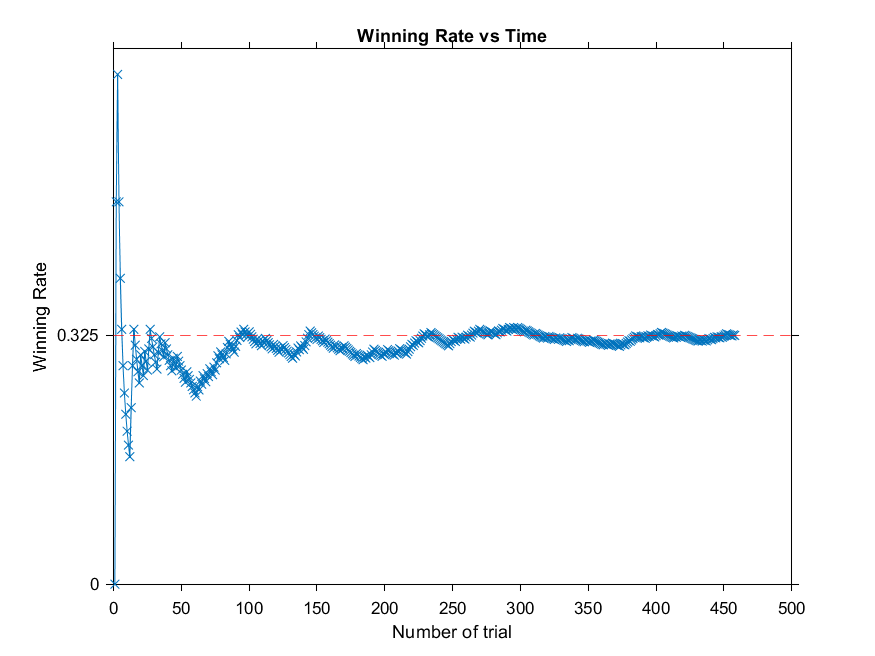

# myMineSweeperAI
Playing Minesweeper itself  

## Overview
- Minesweeper Version: Minesweeper Arbiter 0.52 distribution
- Time for each game: about 30s
- Win Rate: 35%  

- Algorithm: clicking the block that is least likely to be bomb.

## How to use it?
1. Install MATLAB and Python with proper environment.
2. Open .\扫雷\ms_arbiter.exe
3. Run next_move.m & get_possibility.m & UpdateFrame.py
4. Stop running by Middle-Click with your mouse
5. The outcome would be saved in log.txt. Each 0 denotes failure of 1 game and 1 denotes success of 1 game.
6. Run check_log.m to check the statistics of performance

## Outline of the algorithm
1. Get current minefield by examing the screenshot (only tested with my computer with a 2560 x 1440 screen). 
  - Get screenshot with pywin32 package
  - Slice the screenshot to get the picture of each block
  - Compare each block with patterns in ./Pattern. Determine what the block is.
  - Combine all blocks and form a 2D-array. Then the array is sent to MATLAB.
2. For each block, compute the possibility that it is bomb respectively. Because I am more familiar with MATLAB, I make it with MATLAB-Python communication 
  - The problem can be seen as a system of linear equations. Each Blank-block is a variable x and x = 0 or 1. And "Number"-block is a constraint condition.
  - Using 'fmincon' functoin in MATLAB, the blocks that is definately safe could be found.
  - When we must guess a block, classical models of probability could be used. Some tricks must be taken to reduce the computation complexity. The possibility that each block to be bomb is computed.
  - Click the block that is least likely to be bomb.
  - Restart when failed or completed.
  
